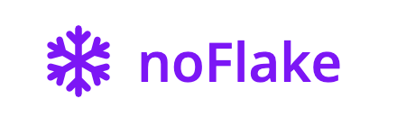
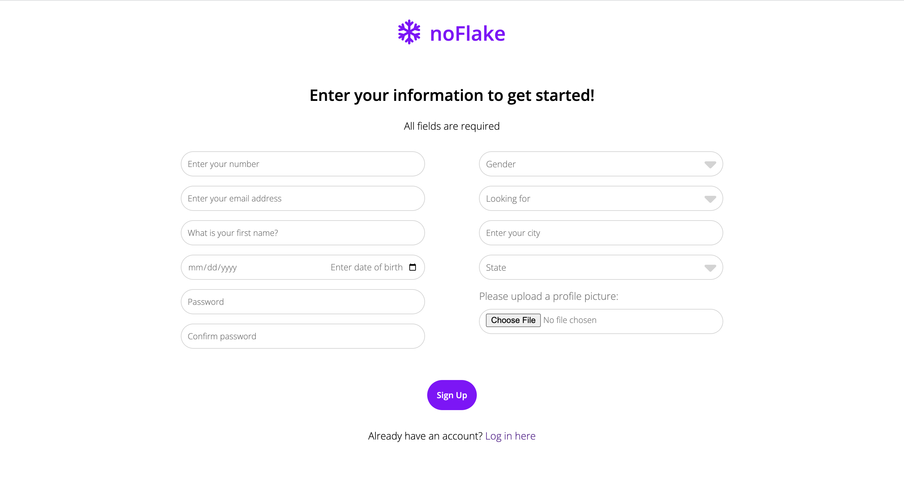
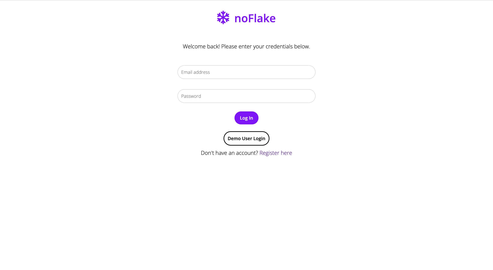

<a name="readme-top"></a>

<!-- PROJECT LOGO -->
<br />
<div align="center">
  <a href="https://github.com/claudiakosylak/bumble-clone-project">
    
  </a>

<h3 align="center">noFlake</h3>

  <p align="center">
    noFlake is a dating site inspired by Bumble, where users can not only match with other users and start a conversation, they can schedule dates within the app and report on other users' "flaking" or "ghosting" activity culminating in that user's public "flake score" for accountability.
    <br />
    <a href="https://github.com/claudiakosylak/bumble-clone-project"><strong>Explore the docs »</strong></a>
    <br />
    <br />
    <a href="https://noflake.onrender.com/">View Live Site</a>
    ·
    <a href="https://github.com/claudiakosylak/bumble-clone-project/issues">Report Bug</a>
    ·
    <a href="https://github.com/claudiakosylak/bumble-clone-project/issues">Request Feature</a>
  </p>
</div>


<!-- TABLE OF CONTENTS -->
<details>
  <summary>Table of Contents</summary>
  <ol>
    <li>
      <a href="#about-the-project">About The Project</a>
      <ul>
        <li><a href="#built-with">Built With</a></li>
      </ul>
    </li>
    <li>
      <a href="#getting-started">Getting Started</a>
      <ul>
        <li><a href="#prerequisites">Prerequisites</a></li>
        <li><a href="#installation">Installation</a></li>
      </ul>
    </li>
    <li><a href="#usage">Usage</a></li>
    <li><a href="#roadmap">Roadmap</a></li>
    <li><a href="#contact">Contact</a></li>
    <li><a href="#acknowledgments">Acknowledgments</a></li>
  </ol>
</details>


<!-- ABOUT THE PROJECT -->
## About The Project

[

Have you ever been disappointed with how many people flake on dating apps? This project is inspired by Bumble in its aesthetics and core matching functionality, but incorporates the ability to schedule dates and keep them accountable using the flake score.

Highlights:
* Socket.io is implemented to allow users to message each other in real time.
* Users can request dates with their existing matches, accept or reject dates, and see all of their upcoming, past and pending dates in one place.
* Users can report "ghosting" by a match at any time, as well as report on flaking activity after a date with different activities holding a different weight on that user's publicly available flake score.
* AWS S3 buckets are implemented to make the picture upload process as easy as possible.

<p align="right">(<a href="#readme-top">back to top</a>)</p>


### Built With

* [![React][React.js]][React-url]
* 

* 
* 
* 

<p align="right">(<a href="#readme-top">back to top</a>)</p>


<!-- GETTING STARTED -->
## Getting Started

To get a local copy up and running follow these simple example steps.

1. Clone this repository

2. Install dependencies

      ```bash
      pipenv install -r requirements.txt
      ```

3. Create a **.env** file with your environment variables based on this example:

   SECRET_KEY=your_secret_key
   DATABASE_URL=your_db_url
   SCHEMA=your_schema_name

   S3_BUCKET=your_bucket_name
   S3_KEY=your_key
   S3_SECRET=your_secret_key

4. Get into your pipenv, migrate your database, seed your database, and run your Flask app

   ```bash
   pipenv shell
   ```

   ```bash
   flask db upgrade
   ```

   ```bash
   flask seed all
   ```

   ```bash
   flask run
   ```

5. To set up the front end, cd into react-app in another terminal. Then install dependencies and start the app:

   ```bash
   npm install
   ```

   ```bash
   npm start
   ```

<p align="right">(<a href="#readme-top">back to top</a>)</p>


<!-- USAGE EXAMPLES -->
## Usage

### Splash Page

Users are directed to the splash page where they can either choose to join the platform or sign in.


### Sign Up

Users can sign in giving their details, and must upload a primary photo for their profile to proceed.




### Log In

Users can log in with their credentials. They can also choose to log in as the demo user to test functionality without making an account.



<p align="right">(<a href="#readme-top">back to top</a>)</p>


<!-- ROADMAP -->
## Roadmap

- [ ] Feature 1
- [ ] Feature 2
- [ ] Feature 3
    - [ ] Nested Feature

See the [open issues](https://github.com/claudiakosylak/bumble-clone-project/issues) for a full list of proposed features (and known issues).

<p align="right">(<a href="#readme-top">back to top</a>)</p>


<!-- CONTACT -->
## Contact

Claudia Kosylak - claudiakosylak@gmail.com

Project Link: [https://github.com/claudiakosylak/bumble-clone-project](https://github.com/claudiakosylak/bumble-clone-project)

<p align="right">(<a href="#readme-top">back to top</a>)</p>


<!-- ACKNOWLEDGMENTS -->
## Acknowledgments

* []()
* []()
* []()

<p align="right">(<a href="#readme-top">back to top</a>)</p>


<!-- MARKDOWN LINKS & IMAGES -->
<!-- https://www.markdownguide.org/basic-syntax/#reference-style-links -->
[contributors-shield]: https://img.shields.io/github/contributors/claudiakosylak/bumble-clone-project.svg?style=for-the-badge
[contributors-url]: https://github.com/claudiakosylak/bumble-clone-project/graphs/contributors
[forks-shield]: https://img.shields.io/github/forks/claudiakosylak/bumble-clone-project.svg?style=for-the-badge
[forks-url]: https://github.com/claudiakosylak/bumble-clone-project/network/members
[stars-shield]: https://img.shields.io/github/stars/claudiakosylak/bumble-clone-project.svg?style=for-the-badge
[stars-url]: https://github.com/claudiakosylak/bumble-clone-project/stargazers
[issues-shield]: https://img.shields.io/github/issues/claudiakosylak/bumble-clone-project.svg?style=for-the-badge
[issues-url]: https://github.com/claudiakosylak/bumble-clone-project/issues
[license-shield]: https://img.shields.io/github/license/claudiakosylak/bumble-clone-project.svg?style=for-the-badge
[license-url]: https://github.com/claudiakosylak/bumble-clone-project/blob/master/LICENSE.txt
[linkedin-shield]: https://img.shields.io/badge/-LinkedIn-black.svg?style=for-the-badge&logo=linkedin&colorB=555
[linkedin-url]: https://linkedin.com/in/claudiakosylak
[product-screenshot]: react-app/src/images/noFlake_main_screenshot.png
[Next.js]: https://img.shields.io/badge/next.js-000000?style=for-the-badge&logo=nextdotjs&logoColor=white
[Next-url]: https://nextjs.org/
[React.js]: https://img.shields.io/badge/React-20232A?style=for-the-badge&logo=react&logoColor=61DAFB
[React-url]: https://reactjs.org/
[Vue.js]: https://img.shields.io/badge/Vue.js-35495E?style=for-the-badge&logo=vuedotjs&logoColor=4FC08D
[Vue-url]: https://vuejs.org/
[Angular.io]: https://img.shields.io/badge/Angular-DD0031?style=for-the-badge&logo=angular&logoColor=white
[Angular-url]: https://angular.io/
[Svelte.dev]: https://img.shields.io/badge/Svelte-4A4A55?style=for-the-badge&logo=svelte&logoColor=FF3E00
[Svelte-url]: https://svelte.dev/
[Laravel.com]: https://img.shields.io/badge/Laravel-FF2D20?style=for-the-badge&logo=laravel&logoColor=white
[Laravel-url]: https://laravel.com
[Bootstrap.com]: https://img.shields.io/badge/Bootstrap-563D7C?style=for-the-badge&logo=bootstrap&logoColor=white
[Bootstrap-url]: https://getbootstrap.com
[JQuery.com]: https://img.shields.io/badge/jQuery-0769AD?style=for-the-badge&logo=jquery&logoColor=white
[JQuery-url]: https://jquery.com
